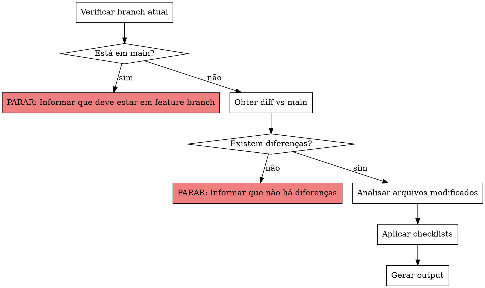

# Rails Code Review

## Overview

Code review de projetos Ruby on Rails seguindo as filosofias de programadores renomados do ecossistema:

- **DHH** - Rails Way, convention over configuration, fat models, thin controllers, concerns over services objects
- **Aaron Patterson** - Performance, N+1 queries, memory, benchmarking
- **Nate Berkopec** - Performance, N+1, queries, memory, benchmarking
- **Jorge Manrubia** - Simplicidade, código explícito, Basecamp patterns
- **Sandi Metz** - Design OOP pragmático, testabilidade

**Referências open source:** Campfire e Fizzy (37signals) como exemplos de Rails Way puro.

**IMPORTANTE:** Este review é focado exclusivamente em encontrar problemas e oportunidades de melhoria. NÃO liste itens que já estão corretos ou funcionando bem. O objetivo é ser direto e útil, não elogiar.

## When to Use

- **APENAS** quando o usuário invocar `/rails-review`
- NÃO usar automaticamente para outros comandos de review

**Requisitos:**
- Deve estar em uma feature branch (não em `main`)
- Deve haver diferenças em relação à branch `main`

## Fluxo de Execução



## Categorias de Review

### 1. Rails Way (DHH/Jorge Manrubia)

**Checklist:**
- [ ] Controllers só fazem CRUD?
- [ ] Lógica de negócio está no model?
- [ ] Concerns extraídos quando há reuso real (não abstração prematura)?
- [ ] Callbacks para efeitos colaterais do domínio?
- [ ] Evitou Service Objects desnecessários?
- [ ] Convention over configuration respeitada?
- [ ] Current attributes quando faz sentido?

**Princípios:**
- "Push down to the model" - Controllers delegam, não decidem
- Concerns são para comportamentos compartilhados e para organizar código relacionado a um model (contextos)
- Callbacks são legítimos para lógica de domínio (after_create, before_save)
- Service Objects só quando realmente orquestra múltiplos objetos, mas a preferência é por concerns seguindo o Rails Way do DHH e do app Fizzy.

### 2. Performance (Aaron Patterson)

**Checklist:**
- [ ] Queries usam `includes`/`preload` onde necessário?
- [ ] Counter caches para contagens frequentes?
- [ ] Índices existem para foreign keys e campos de busca?
- [ ] Fragment caching em views pesadas?
- [ ] Evitou carregar objetos inteiros quando só precisa de IDs/contagens?
- [ ] Bulk operations onde possível (insert_all, update_all)?

**Red Flags:**
```ruby
# N+1 Query
users.each { |u| u.posts.count }  # RUIM
users.includes(:posts).each { |u| u.posts.size }  # BOM

# Carregando demais
User.all.map(&:id)  # RUIM
User.pluck(:id)     # BOM

# Contagem sem cache
user.posts.count  # Query toda vez
user.posts_count  # Counter cache
```

### 3. Hotwire/Stimulus

**Checklist:**
- [ ] Turbo Frames com IDs semânticos e bem delimitados?
- [ ] Turbo Streams para updates granulares?
- [ ] Stimulus controllers focados e pequenos (< 50 linhas)?
- [ ] Data attributes descritivos?
- [ ] Evitou JavaScript desnecessário?
- [ ] Lazy loading com Turbo Frames onde apropriado?
- [ ] Views turbo_stream.erb são prefernciais a lógicas de Turbo nas actions do controller.

**Princípios:**
- HTML over the wire, não JSON
- Stimulus é para comportamento, não para renderização
- Turbo Frames delimitam áreas de atualização
- Turbo Streams para múltiplas atualizações simultâneas

### 4. Testabilidade

**Checklist:**
- [ ] Testes de model para lógica de negócio?
- [ ] Testes de system para fluxos críticos do usuário?
- [ ] Fixtures preferidas sobre factories (Rails Way)?
- [ ] Sem mocks excessivos que escondem bugs de integração?
- [ ] Testes no nível certo (unit vs integration vs system)?

**Princípios:**
- Fixtures são dados reais, factories são abstrações
- Testes de system cobrem o que o usuário vê
- Mocks só para serviços externos, não para seu próprio código

### 5. Clareza/Manutenibilidade

**Checklist:**
- [ ] Nomes expressivos que revelam intenção?
- [ ] Métodos pequenos com responsabilidade única?
- [ ] Código explícito vs "mágica" excessiva?
- [ ] Comments explicam "por quê", não "o quê"?
- [ ] Estrutura de arquivos segue convenções Rails?

## Formato de Output

### Comentários Inline

```ruby
# app/models/user.rb:45
# ⚠️ [Performance] N+1 query detectada
# Aaron Patterson: "Use includes(:posts) para eager load"
#
# Antes:
#   users.each { |u| u.posts.count }
#
# --------------------------------------------------------
#
# Sugestão:
#   users.includes(:posts).each { |u| u.posts.size }
#
# --------------------------------------------------------
```

```ruby
# --------------------------------------------------------
# app/controllers/posts_controller.rb:12
# 💡 [Rails Way] Controller fazendo trabalho demais
# DHH: "Push down to the model"
#
# Mover lógica de filtro para scope no model
```

### Ícones de Severidade

| Ícone | Significado |
|-------|-------------|
| 🔴 | Problema crítico (segurança/performance grave) |
| ⚠️ | Problema que precisa atenção |
| 💡 | Sugestão de melhoria |

**Nota:** Não usar ✅ para "boas práticas". O review só lista o que precisa melhorar.

### Arquivo de Output

Salvar review em `tmp/rails-review-YYYY-MM-DD-HHMMSS.md` dentro da pasta do app:

```markdown
# Rails Code Review - 2026-01-17 14:30

## Resumo
- 🔴 Críticos: 0
- ⚠️ Problemas: 3
- 💡 Sugestões: 5

## Arquivos Revisados

### app/models/user.rb

#### Linha 45 ⚠️ [Performance]
N+1 query detectada...

### app/controllers/posts_controller.rb

#### Linha 12 💡 [Rails Way]
Controller fazendo trabalho demais...
```

## Execução

1. **Verificar pré-condições (OBRIGATÓRIO):**
   ```bash
   # Verificar branch atual
   git branch --show-current
   ```
   - **Se estiver em `main`:** PARAR e informar:
     > "Esta skill só pode ser executada em feature branches. Faça checkout para uma branch de trabalho primeiro."

   ```bash
   # Obter arquivos modificados vs main
   git diff main...HEAD --name-only -- '*.rb' '*.erb' '*.js'
   ```
   - **Se não houver diferenças:** PARAR e informar:
     > "Nenhuma diferença encontrada em relação à branch main. Não há código para revisar."

2. **Analisar arquivos modificados:**
   - Para cada arquivo listado no diff:
     - Ler o diff: `git diff main...HEAD -- <arquivo>`
     - Focar nas linhas modificadas (+/-), mas considerar contexto
   - Carregar `db/schema.rb` para verificar índices
   - Identificar tipo de cada arquivo (Model, Controller, etc.)

3. **Aplicar checklists:**
   - Para cada arquivo, aplicar checklist relevante à categoria
   - Buscar patterns e anti-patterns conhecidos

4. **Gerar output:**
   - Mostrar comentários inline no terminal
   - Agrupar por arquivo, ordenar por severidade (🔴 > ⚠️ > 💡)
   - **NÃO listar itens que estão OK** - apenas problemas e sugestões
   - Se um arquivo não tem problemas, não incluir no output
   - Salvar em `/tmp/rails-review-{timestamp}.md`

5. **Resumo final:**
   - Contagem por severidade
   - Path do arquivo gerado
   - Se não encontrar nenhum problema: informar brevemente e encerrar (não inventar elogios)

## Referências

### Autores
- DHH - Creator of Rails, Basecamp/HEY
- Aaron Patterson - Rails core team, performance expert
- Jorge Manrubia - Basecamp developer, Rails contributor
- Sandi Metz - POODR, practical OOP design

### Código Open Source
- [Campfire](https://github.com/basecamp/campfire) - 37signals chat app
- [Fizzy](https://github.com/basecamp/fizzy) - 37signals app

### Leituras Recomendadas
- "Getting Real" - 37signals
- "POODR" - Sandi Metz
- Aaron Patterson's blog posts on Rails performance
