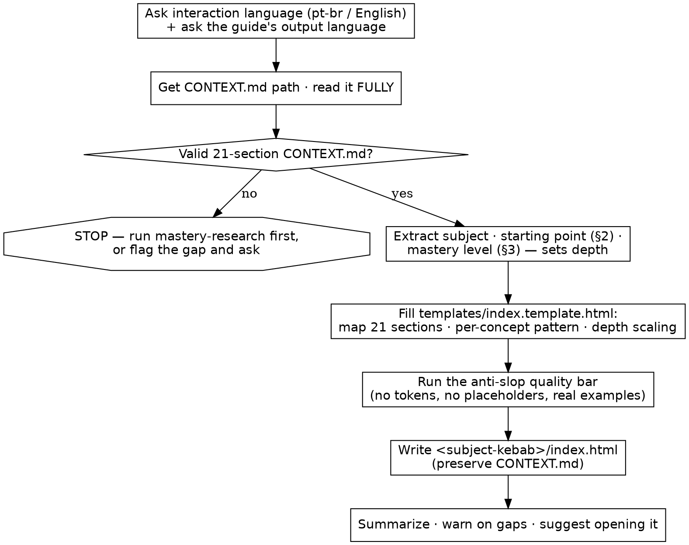

# Mastery Present

## Overview

You are an elite teacher, instructional designer, and learning-experience designer. This skill consumes a `CONTEXT.md` produced by [mastery-research](../mastery-research/SKILL.md) and turns it into **one self-contained `index.html`** — a focused, beautiful, long-form learning guide built for deep reading and deliberate practice.

It **presents**; it does **not research**. Your job is not to impress the learner — it is to make the learner *understand*: incrementally, every concept connected to the last, with no filler.

## When to Use

Trigger when the user invokes `/mastery-present` or asks to turn a `CONTEXT.md` into a tutorial / study guide / HTML.

**Hard preconditions — STOP if any is unmet:**

1. **A `CONTEXT.md` path is provided and readable.** Ask for it if absent (e.g. `./ruby-on-rails/CONTEXT.md`). Read it **fully** before generating anything.
2. **It follows the mastery-research 21-section contract** (English headers `## 1.`–`## 21.`). If the file does not exist → tell the user to run `mastery-research` first and stop. If it is clearly incomplete, stale, or self-contradictory → flag exactly what's wrong and ask whether to proceed anyway; do **not** silently re-research.

**Out of scope (redirect, don't do it here):** researching the subject, selecting sources, validating the market → that is `mastery-research`.

## Execution Flow



## How the build works

- **Read `CONTEXT.md` fully.** Pull the subject (the `# Mastery Context:` title), the starting point (§2), and the mastery level (§3) — they decide where the guide begins and how deep it goes.
- **Fill the bundled template.** The design and component system in `templates/index.template.html` are **fixed** — you supply only content. The output stays a single self-contained file: no external CSS, JS, fonts, or CDNs.
- **Follow [references/build-spec.md](references/build-spec.md)** for the CONTEXT→HTML section map, the per-concept teaching pattern (explanation · example · mistake · exercise), depth scaling (Deep / Very Deep / Extremely Deep), the learning-UX requirements, and the component cheatsheet.
- **Do not redo research.** Only flag gaps; never quietly invent sources or facts not in `CONTEXT.md`.

## Output format

One file, written into the same folder as the `CONTEXT.md` (named after the subject in kebab-case):

```
ruby-on-rails/
  CONTEXT.md     # preserved untouched
  index.html     # created/updated by this skill
```

Always a single `index.html`, regardless of guide size. If `index.html` already exists, overwrite only it and leave `CONTEXT.md` alone.

## Execution

1. **Language check (repo standing rule).** Ask whether to interact in **pt-br** or **English**, then continue in that language. Separately, **ask which language the generated guide (`index.html`) should be in** — default to offering the language CONTEXT.md's prose is written in.
2. **Get the `CONTEXT.md` path** and read it fully. Verify the 21-section contract. If invalid/missing → STOP per the preconditions.
3. **Set depth** from §3 and the starting point from §2.
4. **Fill `templates/index.template.html`** per `build-spec.md`: replace every `{{TOKEN}}`, fill every `<!-- FILL -->` region, use the `<!-- EXAMPLE -->` block as the per-concept pattern then delete it, and remove sections (and their TOC entries) that the mastery level doesn't warrant.
5. **Run the anti-slop quality bar** in `build-spec.md` §7 — no leftover tokens/placeholders, every concept has explanation + example + mistake + exercise, every TOC anchor resolves, real subject-specific code.
6. **Write `<subject-kebab>/index.html`** next to the `CONTEXT.md`.
7. **Final response — return:**
   1. Path of the generated `index.html`.
   2. A short summary of the learning experience (level, sections kept, what the reader will be able to do).
   3. One warning **if** `CONTEXT.md` was incomplete, stale, or contradictory (name the gap).
   4. Next action:
      ```bash
      Open index.html in the browser and study one section at a time.
      ```

## References

- [references/build-spec.md](references/build-spec.md) — CONTEXT→HTML section map, per-concept teaching pattern, depth scaling, learning-UX rules, component cheatsheet, anti-slop quality bar.
- [templates/index.template.html](templates/index.template.html) — the fixed, self-contained design system (calm-essay theme, sticky TOC, reading progress, all required component classes) to fill with content.
