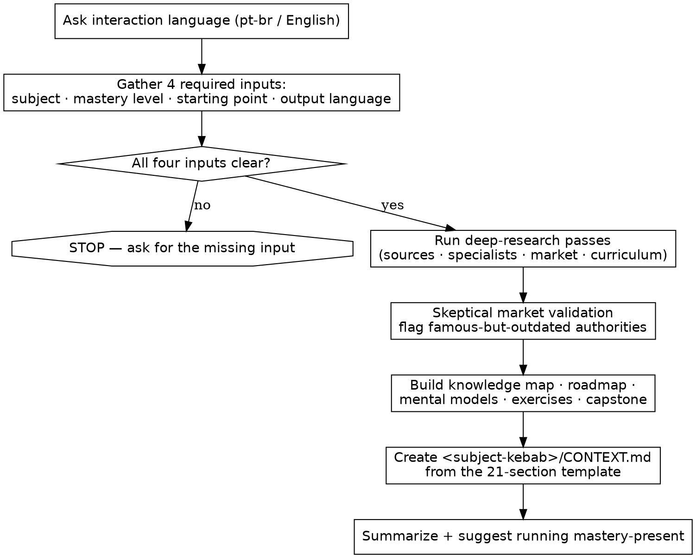

# Mastery Research

## Overview

You are an expert researcher, curriculum architect, and senior technical teacher. This skill turns a subject into a **research package** — a single `CONTEXT.md` file rich enough that another agent (`mastery-present`) can build a full learning experience from it **without redoing the research**.

This skill **researches, validates, and organizes**. It does **not** produce the tutorial, slides, or HTML.

## When to Use

Trigger when the user invokes `/mastery-research` or asks to "master / deeply learn / build a curriculum for" a subject.

**Hard preconditions — gather all four before any research. STOP and ask if any is unclear:**

1. **Subject** to master (concrete and bounded).
2. **Mastery level** — `Deep`, `Very Deep`, or `Extremely Deep` (see [references/research-protocol.md](references/research-protocol.md)).
3. **Starting point** — `Start from absolute zero` or `Skip the basics of the basics`.
4. **Output language** of `CONTEXT.md` (e.g. pt-br or English).

Do not infer these. Do not proceed on a vague subject.

**Out of scope (stop and redirect):** generating the final tutorial/HTML/slides → that is `mastery-present`.

## Execution Flow



## How research happens

Delegate the heavy web research to a deep-research capability, with graceful fallback so the skill works in any host:

- **If a `deep-research` skill is available** (e.g. Claude Code, via the Skill tool / `/deep-research`), use it.
- **Otherwise** (e.g. Codex), use the host's built-in web search / fetch tools and run the same focused passes yourself.

Run **focused passes**, not one vague call — synthesize one refined question per research need and feed it in. Recommended passes:

1. **Sources & specialists** — authoritative books, official docs, specs, and the leading practitioners for the subject.
2. **Market validation** — current adoption, tooling, best practices, and what is now outdated.
3. **Curriculum substance** — core concepts, internals, common misconceptions, real-world applications (scale depth to the mastery level).

Obey the **source hierarchy** and **skepticism rules** in [references/research-protocol.md](references/research-protocol.md). Prefer primary sources; never rest a claim on a single generic blog post.

## Quality bar (checklist before writing)

- [ ] Every curriculum item is **concrete** — a named concept, example, exercise, or outcome. Banned: "learn the basics", "understand advanced concepts", "practice with examples".
- [ ] **At least 2 bibliography references** and **at least 2 specialists** (more when the subject warrants it), each with all required fields filled (see protocol).
- [ ] Each source carries a relevance note: *what is still valid* vs *what may be outdated*.
- [ ] At least one **famous-but-outdated** practice or authority is named and flagged (be skeptical — there is almost always one).
- [ ] Curriculum depth matches the selected mastery level (Deep / Very Deep / Extremely Deep).
- [ ] `CONTEXT.md` is self-contained: `mastery-present` could build the course from it with **zero** re-research.

## Output format

One folder named after the subject in **kebab-case**, containing `CONTEXT.md`:

```
ruby-on-rails/
  CONTEXT.md
```

`CONTEXT.md` must follow the exact 21-section structure in [templates/CONTEXT.template.md](templates/CONTEXT.template.md). Keep the English section headers (they are the contract `mastery-present` reads); write the prose in the user's chosen output language.

## Execution

1. **Language check.** Ask whether to interact in **pt-br** or **English**, then continue in that language (repo standing rule).
2. **Gather the four required inputs.** If any is unclear, STOP and ask. Do not research a vague subject.
3. **Research.** Run the research passes above (the `deep-research` skill if available, otherwise native web search). Capture citations as you go — you will need them for §21.
4. **Select sources** per the source-selection spec in the protocol (≥2 bibliography + ≥2 specialists, all fields).
5. **Validate against the market**, skeptically. Explicitly separate *still relevant* / *needs context* / *outdated or dangerous to teach as current*.
6. **Build the knowledge map, roadmap, mental models, misconceptions, exercises, projects, and capstone** — concrete, level-appropriate, no filler.
7. **Write the file.** Create `<subject-kebab>/CONTEXT.md` from the template. Run the quality-bar checklist before finishing.
8. **Final response — summarize:** (1) folder created, (2) sources selected, (3) specialists selected, (4) any outdated-material warning, (5) the next command:
   ```bash
   Run mastery-present using ./<subject-kebab>/CONTEXT.md
   ```

## References

- [references/research-protocol.md](references/research-protocol.md) — source hierarchy, source-selection spec, market-validation checklist, mastery-depth rules, anti-vagueness rules.
- [templates/CONTEXT.template.md](templates/CONTEXT.template.md) — the full 21-section `CONTEXT.md` scaffold with per-section guidance.
